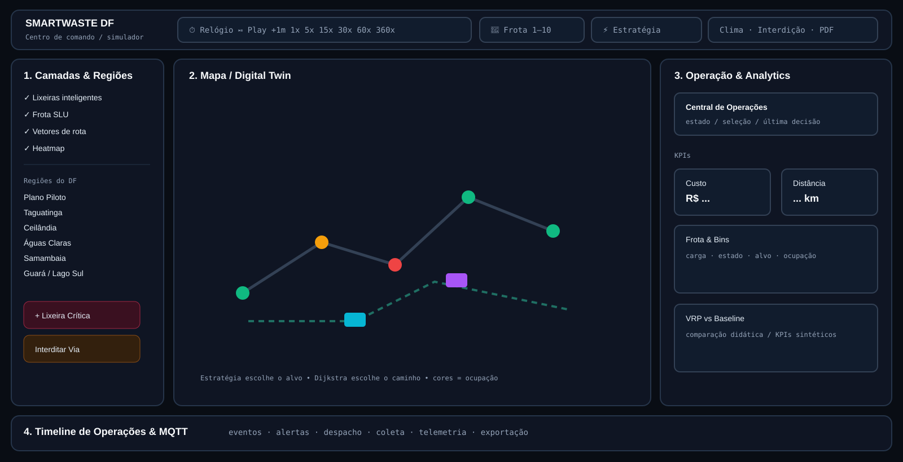
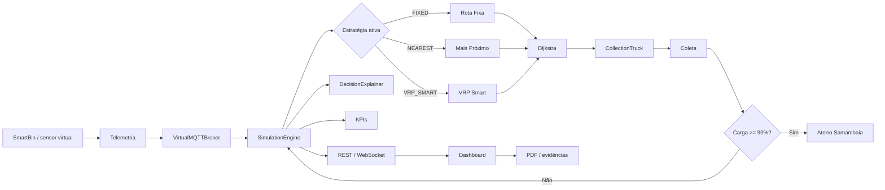
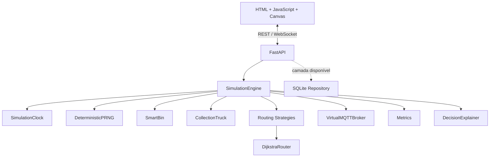
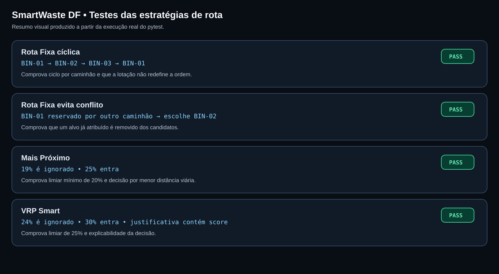
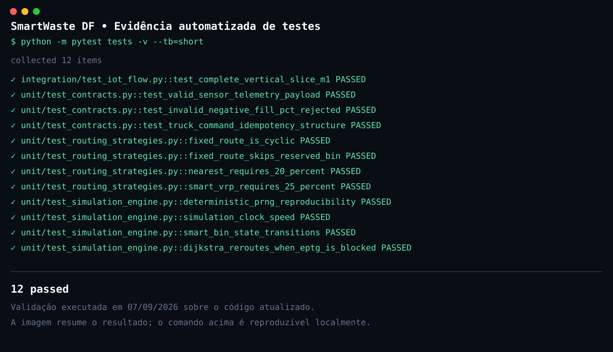

# SmartWaste DF — Digital Twin & Simulação IoT para Coleta Inteligente de Resíduos

> Laboratório **open source**, educacional e de **custo zero** para demonstrar como sensores IoT, telemetria, roteamento, frota, eventos urbanos e análise operacional podem trabalhar juntos em uma operação simulada de coleta inteligente de resíduos no Distrito Federal.



> [!IMPORTANT]
> O SmartWaste DF é uma **simulação experimental**. Custos, emissões, consumo de diesel, geração de resíduos, baseline, economia e demais impactos exibidos são parâmetros de laboratório. Eles **não são medições oficiais do SLU, GDF, IPEDF ou de uma operação real**.

---

## Sumário

- [1. O que é o projeto](#1-o-que-é-o-projeto)
- [2. Qual é o intuito](#2-qual-é-o-intuito)
- [3. Problema que o laboratório representa](#3-problema-que-o-laboratório-representa)
- [4. Impacto que a solução busca demonstrar](#4-impacto-que-a-solução-busca-demonstrar)
- [5. Como o sistema funciona ponta a ponta](#5-como-o-sistema-funciona-ponta-a-ponta)
- [6. Arquitetura atual](#6-arquitetura-atual)
- [7. Como executar](#7-como-executar)
- [8. Guia completo da interface e de cada botão](#8-guia-completo-da-interface-e-de-cada-botão)
- [9. Estados e regras das lixeiras](#9-estados-e-regras-das-lixeiras)
- [10. Caminhões, capacidade e aterro](#10-caminhões-capacidade-e-aterro)
- [11. Estratégias de rota](#11-estratégias-de-rota)
- [12. Dijkstra, trânsito, clima e interdições](#12-dijkstra-trânsito-clima-e-interdições)
- [13. IoT, MQTT virtual e telemetria](#13-iot-mqtt-virtual-e-telemetria)
- [14. API REST e WebSocket](#14-api-rest-e-websocket)
- [15. KPIs, custos e impacto ambiental](#15-kpis-custos-e-impacto-ambiental)
- [16. Exportação do PDF](#16-exportação-do-pdf)
- [17. Linguagens e tecnologias](#17-linguagens-e-tecnologias)
- [18. Estrutura do projeto](#18-estrutura-do-projeto)
- [19. Testes e evidências](#19-testes-e-evidências)
- [20. Atalhos de teclado](#20-atalhos-de-teclado)
- [21. Limitações atuais](#21-limitações-atuais)
- [22. Evoluções recomendadas](#22-evoluções-recomendadas)
- [23. Licença](#23-licença)

---

# 1. O que é o projeto

O **SmartWaste DF** é um **Digital Twin simplificado de uma operação de coleta urbana**. Ele cria uma representação virtual de:

- lixeiras inteligentes;
- sensores;
- telemetria;
- caminhões coletores;
- vias e conexões urbanas;
- clima;
- bloqueios;
- decisões de despacho;
- coleta e descarregamento;
- indicadores econômicos e ambientais.

A ideia é permitir que uma operação complexa seja observada e testada **sem instalar sensores físicos, contratar APIs pagas ou operar uma frota real**.

O sistema modela atualmente **32 lixeiras** distribuídas por regiões do DF, **3 caminhões no cenário padrão do backend**, um ponto de descarte no **Aterro Sanitário de Samambaia**, uma malha viária simplificada e três políticas diferentes para selecionar qual lixeira deve ser atendida.

O projeto não é somente uma animação. Existe lógica de domínio no backend para:

- atualizar ocupação das lixeiras;
- calcular estados de criticidade;
- escolher alvos;
- calcular caminhos;
- movimentar caminhões;
- coletar resíduos;
- controlar capacidade;
- enviar caminhões ao aterro;
- publicar mensagens de telemetria;
- registrar justificativas;
- calcular métricas;
- disponibilizar estado por REST e WebSocket.

---

# 2. Qual é o intuito

O objetivo principal é **fechar o ciclo completo de um sistema IoT aplicado a uma cidade inteligente**:

```text
SENSOR
  ↓
TELEMETRIA
  ↓
COMUNICAÇÃO / BROKER
  ↓
BACKEND
  ↓
MOTOR DE DECISÃO
  ↓
ROTEAMENTO
  ↓
ATUADOR / CAMINHÃO
  ↓
COLETA
  ↓
DESCARTE
  ↓
MÉTRICAS + AUDITORIA
```

O laboratório foi pensado para estudar e demonstrar:

- Engenharia de Requisitos;
- Engenharia de Software;
- Internet das Coisas;
- contratos de dados;
- publish/subscribe;
- idempotência;
- APIs REST;
- WebSocket;
- algoritmos de grafos;
- heurísticas de roteamento;
- logística de frota;
- simulação determinística;
- Digital Twin;
- explicabilidade de decisões;
- testes unitários e de integração;
- indicadores de custo e sustentabilidade.

Em vez de apresentar somente conceitos separados, o projeto tenta mostrar **como essas peças se conectam em uma aplicação completa**.

---

# 3. Problema que o laboratório representa

Imagine uma coleta tradicional baseada em uma sequência rígida:

```text
BIN-01 → BIN-02 → BIN-03 → BIN-04 → ...
```

Esse modelo é simples, porém ele não necessariamente conhece a condição atual de cada ponto.

Pode acontecer de:

- um caminhão visitar uma lixeira quase vazia;
- outra lixeira, mais distante, estar perto de transbordar;
- uma via importante ficar bloqueada;
- o caminhão estar quase cheio;
- a chuva reduzir a velocidade;
- duas equipes receberem o mesmo destino;
- a rota original deixar de ser a melhor escolha.

Um sistema IoT pode fornecer **telemetria de ocupação em tempo quase real**. A partir disso, o software pode testar políticas que considerem demanda, criticidade, distância e capacidade.

O SmartWaste DF existe para tornar essa diferença visível e mensurável em laboratório.

---

# 4. Impacto que a solução busca demonstrar

Em uma aplicação real, uma arquitetura semelhante **poderia** contribuir para:

- reduzir deslocamentos desnecessários;
- priorizar pontos com maior risco de transbordo;
- melhorar utilização da capacidade dos veículos;
- reagir a bloqueios de via;
- registrar cada decisão para auditoria;
- melhorar visibilidade da operação;
- apoiar análise de combustível e emissões;
- comparar estratégias antes de adotá-las em campo.

> [!NOTE]
> O projeto demonstra **potencial e comportamento do modelo**, não ganhos reais garantidos. Para afirmar impacto operacional seria necessário calibrar o sistema com dados históricos, telemetria de campo, rotas reais, custos reais e múltiplas execuções controladas.

---

# 5. Como o sistema funciona ponta a ponta



## Passo a passo

1. O relógio da simulação avança.
2. Cada `SmartBin` recebe geração de resíduos conforme seus parâmetros.
3. O estado da lixeira é recalculado.
4. Leituras podem ser publicadas em tópicos de telemetria do broker virtual.
5. O backend verifica caminhões ociosos.
6. A estratégia ativa seleciona **qual lixeira atender**.
7. O Dijkstra calcula **qual caminho percorrer**.
8. Um comando de rota é registrado/publicado.
9. O caminhão percorre o grafo.
10. Ao chegar, entra em estado de coleta.
11. O conteúdo é transferido para o caminhão respeitando capacidade restante.
12. Um ACK de coleta é publicado.
13. Se o caminhão atingir a regra de lotação, ele vai ao aterro.
14. Ao descarregar, volta a ficar disponível.
15. Métricas e estado são atualizados.
16. A interface recebe o estado e apresenta mapa, timeline e indicadores.

---

# 6. Arquitetura atual

O backend segue uma abordagem de **monólito modular**: existe um serviço FastAPI único, porém o domínio é separado por responsabilidades.



## O que está realmente conectado hoje

| Componente | Situação |
|---|---|
| FastAPI | Ativo |
| REST | Ativo |
| WebSocket | Ativo |
| SimulationEngine | Ativo |
| Dijkstra | Ativo |
| Rota Fixa | Ativo |
| Mais Próximo | Ativo |
| VRP Smart | Ativo |
| Broker MQTT virtual | Ativo em memória |
| SQLite | Camada criada, mas ainda não conectada ao fluxo principal |
| PostGIS | Não ativo |
| Mosquitto/EMQX real | Não ativo |
| OR-Tools | Não ativo |

Essa distinção é importante: a documentação descreve **o que o código atual faz**, separando implementação, simulação e evolução futura.

Mais detalhes: [`docs/architecture.md`](docs/architecture.md).

---

# 7. Como executar

## 7.1 Requisitos

- Python 3;
- pip;
- navegador moderno;
- dependências Python do projeto.

Instalação rápida das dependências centrais:

```bash
pip install fastapi uvicorn pydantic pytest
```

## 7.2 Windows — PowerShell

Entre na pasta do projeto e execute:

```powershell
.\run_lab.bat
```

ou:

```powershell
python run_lab.py
```

> No PowerShell, o `./` ou `.\` é importante quando o `.bat` está na pasta atual.

## 7.3 Windows — CMD

```cmd
run_lab.bat
```

## 7.4 macOS / Linux

```bash
python run_lab.py
```

## 7.5 Endereços

| Recurso | Endereço |
|---|---|
| Aplicação integrada | `http://localhost:8000` |
| Swagger / OpenAPI | `http://localhost:8000/docs` |
| Estado atual | `http://localhost:8000/api/v1/state` |
| Health check | `http://localhost:8000/health` |
| Readiness | `http://localhost:8000/ready` |
| WebSocket | `ws://localhost:8000/ws/scenarios/default` |

A execução recomendada é pela porta **8000**, porque o FastAPI também entrega a interface e injeta o módulo `apps/web/routing-docs-enhancements.js`, que mantém a documentação de roteamento/PDF alinhada ao backend.

## 7.6 Testes

```bash
python -m pytest tests -v --tb=short
```

---

# 8. Guia completo da interface e de cada botão

A tela foi dividida em quatro áreas principais:

1. **barra superior de controle**;
2. **painel esquerdo de camadas e eventos**;
3. **mapa central / Digital Twin**;
4. **painel direito + timeline inferior**.

## 8.1 Barra superior

| Controle | O que faz | O que altera/gera |
|---|---|---|
| **SMARTWASTE DF / status** | Indica o estado do simulador/conexão. | Feedback visual do ambiente. |
| **Relógio** | Mostra hora e dia simulados. | Referência temporal de eventos e métricas. |
| **Play/Pause** | Pausa ou retoma o relógio. | Interrompe/retoma evolução de bins e caminhões. |
| **Avançar +1 min** | Avança um minuto simulado manualmente. | Executa um passo adicional de simulação. |
| **1x** | Velocidade normal. | 1 segundo real ≈ 1 segundo simulado. |
| **5x** | Acelera cinco vezes. | Mais eventos por tempo real. |
| **15x** | Acelera quinze vezes. | Aproxima mais rapidamente mudanças de estado. |
| **30x** | Acelera trinta vezes. | Útil para observar evolução intermediária. |
| **60x** | Acelera sessenta vezes. | 1 segundo real ≈ 1 minuto simulado. |
| **360x** | Aceleração forte. | Permite observar horas simuladas rapidamente. |
| **Frota 1–10** | Altera quantidade de caminhões no simulador visual. | Cria/remove caminhões na lógica local da interface. |
| **VRP Smart** | Ativa política adaptativa. | Próximos despachos passam a usar score de criticidade/distância/capacidade. |
| **Rota Fixa** | Ativa baseline sequencial. | Próximos despachos seguem ordem cíclica por BIN. |
| **Mais Próximo** | Ativa heurística gulosa. | Próximos despachos escolhem menor distância entre candidatos >=20%. |
| **Clima** | Seleciona Seco/Chuva Leve/Chuva Forte/Tempestade. | Modifica fator de velocidade e gera evento de ambiente. |
| **Interdição** | Interdita/libera uma via de teste. | Recalcula caminhos e gera evento operacional. |
| **Áudio** | Liga/desliga efeitos sonoros. | Somente apresentação; não altera decisão logística. |
| **Ajuda (?)** | Abre guia de uso/atalhos. | Modal de orientação. |
| **Reset** | Reinicia o cenário. | Reinicializa relógio/estado e chama reset do backend no modo integrado. |
| **Exportar PDF** | Cria relatório da simulação. | Gera arquivo PDF com cenário, metodologia, KPIs, frota e telemetria. |

### Observação sobre o seletor de frota

O frontend oferece **1 a 10 caminhões** para experimentação visual. O backend Python mantém **3 caminhões padrão** em `SimulationEngine`. Portanto, aumentar a frota na tela ainda não significa que o backend foi reconfigurado com a mesma quantidade. Essa sincronização é uma evolução recomendada.

## 8.2 Clima

| Opção | Fator atual | Efeito esperado no laboratório |
|---|---:|---|
| **Seco** | `1.00x` | Velocidade normal. |
| **Chuva Leve** | `0.95x` | Redução leve. |
| **Chuva Forte** | `0.70x` | Redução de 30%. |
| **Tempestade** | `0.50x` | Redução de 50%. |

No backend atual, o mesmo fator também participa da geração simulada de resíduos. Isso é uma **simplificação do modelo**, não uma relação física validada.

## 8.3 Painel esquerdo — Camadas

| Item | Função |
|---|---|
| **Lixeiras Inteligentes** | Exibe/oculta os pontos de coleta. |
| **Frota SLU** | Exibe/oculta caminhões. |
| **Vetores de Rota** | Exibe/oculta rotas e deslocamentos. |
| **Heatmap de Resíduos** | Destaca regiões de maior ocupação. |

Esses controles alteram a **visualização**, não a regra logística em si.

## 8.4 Regiões do DF

O painel lista regiões modeladas e permite focar visualmente partes da malha, como:

- Plano Piloto;
- Taguatinga;
- Ceilândia;
- Águas Claras;
- Samambaia;
- Guará;
- Lago Sul/Norte;
- Sudoeste e conexões do cenário.

## 8.5 `+ Lixeira Crítica (>85%)`

É um botão de **injeção de evento de estresse**.

No backend, a ação de teste `force_critical_bin()` leva um ponto a **95%**, publica um alerta e força nova avaliação de despacho.

Ele serve para demonstrar:

1. mudança de estado;
2. alerta;
3. decisão;
4. escolha do caminhão/alvo;
5. rota;
6. registro da justificativa.

Ou seja, não é só um efeito visual: ele foi criado para testar a reação do motor.

## 8.6 `Interditar Via Aleatória`

Bloqueia uma ligação da malha simulada.

O efeito esperado é:

```text
via disponível
    ↓
via bloqueada
    ↓
aresta deixa de participar do caminho
    ↓
Dijkstra recalcula
    ↓
rota muda quando existe alternativa
```

A suíte automatizada possui um teste específico para comprovar o redirecionamento quando a EPTG é bloqueada.

## 8.7 Mapa central

O mapa não é um serviço de navegação completo. Ele representa um **grafo viário simplificado** do DF.

A distinção central é:

> **A estratégia escolhe o destino. O Dijkstra escolhe o caminho até o destino.**

O mapa mostra:

- lixeiras;
- caminhões;
- vias;
- rotas;
- cores de criticidade;
- áreas/regiões;
- aterro;
- eventos de bloqueio.

### Controles do mapa

| Botão | Ação |
|---|---|
| **+** | Aproxima o mapa. |
| **−** | Afasta o mapa. |
| **Alvo/Crosshair** | Restaura/centraliza a câmera. |
| **Clique em BIN** | Abre detalhes da lixeira. |
| **Clique em caminhão** | Abre estado, carga, destino e dados do veículo. |

## 8.8 Legenda de ocupação

| Ocupação | Estado | Significado no laboratório |
|---:|---|---|
| `< 50%` | Normal | Sem urgência visual. |
| `50–69%` | Atenção | Ocupação intermediária. |
| `70–84%` | Alta | Requer maior atenção. |
| `85–99%` | Crítica | Alto risco de atingir limite. |
| `>=100%` | Transbordo | Limite excedido. |

## 8.9 Painel direito — `Operação`

Mostra a visão corrente da operação.

Pode apresentar:

- item selecionado;
- estado operacional;
- última decisão;
- custo estimado;
- distância;
- diesel/CO₂;
- transbordos;
- resíduos coletados;
- gráficos regionais.

## 8.10 `VRP vs Baseline`

Exibe uma comparação didática entre a execução inteligente e um baseline.

> [!WARNING]
> O baseline analítico atual é calculado por **multiplicadores configurados**, e não por uma segunda simulação completa independente. Portanto, os percentuais são úteis para demonstração da estrutura de KPI, mas não devem ser apresentados como estudo científico de economia real.

## 8.11 `Frota & Bins`

Permite acompanhar:

- caminhão;
- estado (`OCIOSO`, `EM_ROTA`, `COLETANDO`, `INDO_DESCARTE`, etc.);
- carga em kg;
- percentual de capacidade;
- destino atual;
- situação das lixeiras.

## 8.12 `Última Decisão de Despacho`

Mostra a justificativa textual produzida pelo motor.

Exemplo conceitual:

```text
VRP Smart IoT: BIN-14 selecionada com score X
(Lotação: 86%, Distância: Y km).
```

A função é permitir **explicabilidade e auditoria**: não basta o sistema mandar o caminhão; ele registra por que tomou aquela decisão.

## 8.13 Timeline de Operações & MQTT

A timeline inferior é o histórico observável do laboratório.

Ela registra eventos como:

- telemetria;
- alerta crítico;
- despacho;
- início de coleta;
- coleta concluída;
- descarregamento;
- mudança de estratégia;
- clima;
- bloqueio/liberação de via;
- exportação de relatório.

É útil para demonstrar a ordem dos eventos e inspecionar o comportamento do sistema durante os testes.

---

# 9. Estados e regras das lixeiras

Cada `SmartBin` possui, entre outros dados:

- ID;
- nome;
- região administrativa;
- nó da malha;
- tipo de área;
- capacidade em litros;
- ocupação;
- taxa de geração;
- temperatura;
- bateria do sensor;
- massa estimada.

A massa estimada segue a densidade de laboratório:

```text
massa_kg = (ocupacao_pct / 100) × capacidade_litros × 0,40
```

Essa densidade é um parâmetro de simulação.

### Geração ao longo do dia

O backend usa fatores de horário para aumentar/reduzir a geração simulada, por exemplo:

- pico residencial pela manhã/noite;
- pico comercial no almoço;
- redução na madrugada.

Uma seed determinística controla o ruído pseudoaleatório, permitindo reproduzir cenários.

---

# 10. Caminhões, capacidade e aterro

O cenário padrão do backend cria três veículos:

- `TR-01` — SLU Asa Express;
- `TR-02` — SLU Águas/Taguatinga;
- `TR-03` — SLU Ceilândia/Oeste.

Cada caminhão possui capacidade padrão de **5.000 kg**.

## Regra de descarte

Quando o caminhão atinge a condição de `is_full` usada pelo modelo — aproximadamente **90% da capacidade** — a regra de aterro prevalece sobre a política de coleta.

```text
caminhão ocioso
    ↓
carga >= limite operacional?
    ├─ SIM → ATERRO_SAMAMBAIA
    └─ NÃO → avaliar próxima lixeira
```

Ao chegar ao aterro:

1. inicia descarregamento;
2. zera/retira a carga;
3. publica ACK de descarte;
4. volta a ficar disponível para novas coletas.

## Evitar dois caminhões no mesmo alvo

As estratégias removem candidatos que já estão atribuídos a outro veículo. Isso reduz conflito de despacho.

---

# 11. Estratégias de rota

O seletor de estratégia permite comparar três filosofias diferentes.

## 11.1 Rota Fixa — `FIXED`

### O que representa

É o baseline mais previsível: um roteiro cíclico pré-definido.

```text
BIN-01 → BIN-02 → ... → BIN-32 → BIN-01 → ...
```

### Como decide

Cada caminhão possui seu próprio cursor na sequência.

Ao receber novo despacho:

1. localiza o próximo BIN numérico;
2. **não usa a ocupação para alterar prioridade**;
3. pula ponto já atribuído a outro caminhão;
4. pula ponto sem caminho viável;
5. seleciona o próximo ponto alcançável;
6. após o último, reinicia o ciclo.

### Vantagens

- simples;
- previsível;
- fácil de reproduzir;
- fácil de auditar;
- baixa complexidade;
- ótimo como referência/base para comparação.

### Desvantagens

- pode visitar lixeira pouco cheia;
- pode deixar ponto crítico esperando;
- não reage à criticidade em tempo real;
- pode gerar deslocamento desnecessário;
- não otimiza a sequência global.

### Quando usar no laboratório

Quando o objetivo for observar o comportamento de um **roteiro rígido** e compará-lo com políticas adaptativas.

---

## 11.2 Mais Próximo — `NEAREST`

### O que representa

Uma heurística gulosa de **Nearest Neighbor**.

### Como decide

1. filtra lixeiras com `fill_pct >= 20%`;
2. remove alvos já reservados;
3. calcula distância viária com Dijkstra;
4. escolhe a menor distância.

```text
alvo = candidato válido com menor distância viária
```

### Vantagens

- simples e rápida;
- usa a posição atual do caminhão;
- tende a reduzir o próximo deslocamento;
- reage à distribuição espacial dos pontos.

### Desvantagens

- é gulosa/local;
- o melhor próximo passo não garante a melhor rota total;
- uma lixeira crítica distante pode perder para uma moderada próxima;
- não usa a capacidade restante como fator de prioridade;
- não garante ótimo global.

### Quando usar

Quando se quer isolar o efeito da **proximidade** sem adicionar pesos de criticidade/capacidade.

---

## 11.3 VRP Smart — `VRP_SMART`

### O que representa

Uma heurística adaptativa inspirada em problemas de roteamento de veículos.

> O nome VRP Smart descreve a proposta do laboratório. A implementação atual **não é um solver matemático exato de VRP/CVRP/VRPTW** e não garante ótimo global.

### Filtro inicial

Somente lixeiras com:

```text
fill_pct >= 25%
```

entram na disputa.

### Peso de urgência

A base é o percentual de ocupação:

```text
urgencia = fill_pct
```

Multiplicadores:

```text
>= 70%  → urgência × 1,6
>= 85%  → urgência × 2,8
>= 100% → urgência × 4,0
```

### Penalidade de capacidade

Se a massa estimada da lixeira for maior que a capacidade restante do caminhão:

```text
capacity_penalty = 0,70
```

Caso contrário:

```text
capacity_penalty = 1,00
```

### Score

```text
score = (urgencia^1,8 × capacity_penalty) / (distancia_km + 2,0)
```

O candidato com **maior score** vence.

O `+2,0` reduz instabilidade em distâncias muito próximas de zero.

### Vantagens

- aumenta peso de pontos críticos;
- ainda considera distância;
- considera capacidade restante;
- reage à telemetria;
- gera justificativa de score;
- é mais flexível que rota fixa ou nearest puro.

### Desvantagens

- depende da calibração dos pesos;
- não resolve a frota como otimização global;
- sensor incorreto pode influenciar a decisão;
- limiares são parâmetros de laboratório;
- necessita calibração com dados reais para uso operacional.

### Quando usar

Quando o objetivo for testar **priorização por risco + distância + capacidade**.

---

## 11.4 Comparação direta

| Critério | Rota Fixa | Mais Próximo | VRP Smart |
|---|---|---|---|
| Código | `FIXED` | `NEAREST` | `VRP_SMART` |
| Limiar de entrada | Não usa ocupação como prioridade | `>=20%` | `>=25%` |
| Ocupação altera prioridade | Não | Apenas pelo filtro | Sim |
| Peso especial 70/85/100% | Não | Não | Sim |
| Distância | Caminho até item da sequência | Critério principal | Parte do score |
| Capacidade restante | Regra geral do aterro | Regra geral do aterro | Penalidade no score + aterro |
| Evita alvo já reservado | Sim | Sim | Sim |
| Reage a bloqueio | Sim via Dijkstra | Sim | Sim |
| Ótimo global garantido | Não | Não | Não |
| Ponto forte | Previsibilidade | Próximo deslocamento curto | Equilíbrio adaptativo |
| Principal risco | Ineficiência/baixa adaptação | Miopia gulosa | Calibração da heurística |

## 11.5 Exemplo conceitual

Suponha:

- BIN-A: 35%, 1 km;
- BIN-B: 92%, 5 km;
- BIN-C: 60%, 2 km.

Tendência:

- **Rota Fixa:** escolhe o próximo item da sequência;
- **Mais Próximo:** tende a escolher BIN-A;
- **VRP Smart:** tende a favorecer BIN-B por causa do multiplicador crítico, dependendo de distância e capacidade.

## Evidência automatizada das estratégias



Os testes comprovam o ciclo da rota fixa, prevenção de conflito, limiar de 20% do Nearest e limiar/score do VRP Smart.

---

# 12. Dijkstra, trânsito, clima e interdições

## 12.1 Dijkstra

`DijkstraRouter` calcula o menor caminho disponível sobre a malha modelada.

Ele recebe:

- nó de origem;
- nó de destino;
- condição de pico;
- vias bloqueadas.

E retorna:

```text
(lista_de_nos, distancia_km)
```

Se não houver caminho viável:

```text
distancia = infinito
```

Assim, um destino inalcançável não é tratado como uma rota válida.

## 12.2 Horário de pico

A simulação considera pico aproximadamente em:

```text
07:30–09:30
17:30–19:30
```

Trechos modelados da EPTG recebem penalidade:

```text
peso_da_via × 1,8
```

Isso não representa trânsito oficial; é um mecanismo de laboratório para mudar o custo do grafo.

## 12.3 Interdição

Uma via bloqueada é removida da adjacência do Dijkstra enquanto o evento estiver ativo.

Isso permite demonstrar replanejamento.

## 12.4 Clima

O backend possui os fatores:

```text
SECO          = 1,00
CHUVA_LEVE    = 0,95
CHUVA_FORTE   = 0,70
TEMPESTADE    = 0,50
```

Esses fatores reduzem a velocidade do caminhão.

No código atual, eles também entram na fórmula de geração de resíduos; essa associação é didática e deve ser separada em uma evolução futura caso o modelo busque maior fidelidade científica.

---

# 13. IoT, MQTT virtual e telemetria

## 13.1 O que é simulado

O projeto reproduz conceitos de um pipeline IoT sem exigir hardware:

```text
SmartBin
   ↓
telemetria
   ↓
VirtualMQTTBroker
   ↓
SimulationEngine
   ↓
comando
   ↓
CollectionTruck
   ↓
ACK
```

## 13.2 Broker MQTT virtual

`VirtualMQTTBroker` roda **em memória no processo Python**.

Ele implementa conceitos de:

- publish;
- subscribe;
- tópicos;
- retain;
- histórico recente;
- campo de QoS;
- idempotência de comandos por `command_id`.

### O que ele não é

Ele não abre uma rede MQTT real e não substitui completamente:

- Eclipse Mosquitto;
- EMQX;
- HiveMQ;
- TLS MQTT;
- persistência de sessões;
- QoS real ponta a ponta;
- retained messages persistentes após reinício.

O objetivo é manter o laboratório sem dependências externas.

## 13.3 Exemplos de tópicos

```text
smartwaste/df/bins/{BIN_ID}/telemetry
smartwaste/df/trucks/{TRUCK_ID}/commands
smartwaste/df/trucks/{TRUCK_ID}/acks
smartwaste/df/alerts
smartwaste/df/environment/weather
smartwaste/df/environment/traffic
```

## 13.4 Telemetria de lixeira

Uma mensagem pode incluir:

```json
{
  "event_id": "EVT-...",
  "bin_id": "BIN-12",
  "sim_time": "...",
  "fill_pct": 88.5,
  "distance_cm": 13.8,
  "temperature_c": 27.5,
  "battery_pct": 95.0,
  "status": "CRITICA"
}
```

## 13.5 Idempotência

Comandos de caminhão usam `command_id`.

O broker guarda IDs já processados e rejeita duplicidade dentro da janela em memória.

A intenção é demonstrar uma regra importante de IoT distribuído: **o mesmo comando não deve ser executado duas vezes por acidente**.

---

# 14. API REST e WebSocket

## 14.1 Endpoints principais

| Método | Endpoint | Função |
|---|---|---|
| `GET` | `/health` | Verifica se o serviço está vivo. |
| `GET` | `/ready` | Exibe prontidão de componentes. |
| `GET` | `/api/v1/state` | Estado completo da simulação. |
| `POST` | `/api/v1/scenarios/{id}/pause` | Pausa. |
| `POST` | `/api/v1/scenarios/{id}/resume` | Retoma. |
| `POST` | `/api/v1/scenarios/{id}/speed` | Altera velocidade. |
| `POST` | `/api/v1/scenarios/{id}/strategy` | Altera estratégia. |
| `POST` | `/api/v1/scenarios/{id}/weather` | Altera clima. |
| `POST` | `/api/v1/scenarios/{id}/reset` | Reinicia cenário. |
| `POST` | `/api/v1/roads/block` | Bloqueia/libera EPTG no backend. |
| `POST` | `/api/v1/alerts/force-critical` | Força lixeira crítica. |
| `GET` | `/api/v1/export` | Exporta snapshot em JSON. |

## 14.2 `/ready`

O endpoint explicita a diferença entre disponibilidade e integração:

```text
SQLITE_LAYER_AVAILABLE_NOT_WIRED
IN_MEMORY_BROKER_READY
```

Isso significa que a classe/repositório SQLite existe, mas o motor principal ainda não grava automaticamente toda a simulação nela.

## 14.3 WebSocket

Endpoint:

```text
/ws/scenarios/{scenario_id}
```

Ao conectar, o servidor envia:

```text
FULL_SNAPSHOT
```

Depois transmite atualizações periódicas:

```text
DELTA_UPDATE
```

O canal também recebe comandos como:

- `PAUSE`;
- `RESUME`;
- `SET_SPEED`.

A frequência atual de atualização é aproximadamente a cada **0,5 segundo**, dependendo do loop e do ambiente.

---

# 15. KPIs, custos e impacto ambiental

`EconomicEnvironmentalMetrics` calcula indicadores didáticos.

## 15.1 Parâmetros atuais

| Parâmetro | Valor padrão |
|---|---:|
| Custo por km | `R$ 3,50/km` |
| Custo por hora | `R$ 45,00/h` |
| Diesel | `R$ 6,20/L` |
| Viagem ao aterro | `R$ 85,00` |
| Penalidade de transbordo | `R$ 25,00` |
| Emissão por litro de diesel | `2,68 kg CO₂/L` |

## 15.2 Fórmula de custo

```text
custo =
  distância × custo_km
+ horas × custo_hora
+ diesel × preço_diesel
+ viagens_aterro × custo_viagem_aterro
+ transbordos × penalidade_transbordo
```

## 15.3 Indicadores apresentados

- custo inteligente estimado;
- baseline estimado;
- economia em R$;
- economia em %;
- distância percorrida;
- distância poupada estimada;
- diesel poupado estimado;
- CO₂ evitado estimado;
- transbordos atuais;
- massa total coletada.

## 15.4 Como o baseline atual funciona

O baseline interno usa multiplicadores didáticos sobre a execução inteligente, por exemplo:

```text
distância baseline ≈ smart × 1,58
horas baseline     ≈ smart × 1,45
diesel baseline    ≈ smart × 1,62
```

Por isso:

> **não interpretar o painel “VRP vs Baseline” como experimento científico concluído.**

Para comparação rigorosa, as três estratégias devem ser executadas separadamente com a mesma seed, mesmo horizonte, mesma frota, mesmos eventos e métricas independentes.

---

# 16. Exportação do PDF

O botão **Exportar PDF** usa `jsPDF` e `AutoTable` no navegador.

O relatório atualizado foi preparado para registrar:

- identificação do SmartWaste DF;
- horário/data simulados;
- estratégia ativa;
- descrição das três estratégias;
- critérios de Rota Fixa;
- critérios de Mais Próximo;
- fórmula e pesos do VRP Smart;
- vantagens e desvantagens;
- KPIs atuais;
- frota;
- telemetria/situação dos bins;
- observações metodológicas;
- indicação de que os dados são simulados.

O PDF é uma **evidência do cenário corrente**, não um laudo de desempenho oficial.

### Relação entre seletor e PDF

Se o usuário executar um cenário com `NEAREST`, por exemplo, o PDF registra a estratégia ativa e também explica como as três políticas se diferenciam. Isso ajuda quem recebe o relatório a entender **por que a rota foi escolhida daquela forma**.

---

# 17. Linguagens e tecnologias

Esta seção explica não apenas *o que foi usado*, mas **para que serve, por que faz sentido no projeto e quais são seus pontos positivos e negativos**.

## 17.1 Python

### Onde é usado

Principal linguagem do backend:

- motor de simulação;
- entidades;
- regras de negócio;
- Dijkstra;
- estratégias de rota;
- métricas;
- broker virtual;
- contratos;
- API;
- testes.

### Por que foi escolhido

Python permite escrever algoritmos e regras de simulação de forma legível, possui ótimo ecossistema para APIs e testes e reduz o custo de entrada para um projeto acadêmico.

### Pontos positivos

- sintaxe clara;
- alta produtividade;
- excelente para prototipação e simulação;
- ecossistema amplo;
- integração fácil com FastAPI e pytest;
- bom para algoritmos e análise de dados.

### Pontos negativos

- desempenho bruto inferior a C/C++/Rust em cargas muito altas;
- tipagem é dinâmica por padrão;
- CPU-bound pesado pode exigir otimização/processos separados;
- para produção massiva, seria necessário medir performance antes de escalar.

---

## 17.2 HTML5

### Onde é usado

Estrutura da interface principal em `index.html`.

### Por que foi escolhido

Permite uma aplicação visual executável diretamente no navegador sem build complexo.

### Pontos positivos

- padrão aberto;
- simples de executar;
- compatível com navegadores;
- ótimo para uma demo distribuível.

### Pontos negativos

- o arquivo atual concentra muita responsabilidade;
- grandes blocos de HTML ficam mais difíceis de manter;
- em evolução de produto, componentes separados seriam melhores.

---

## 17.3 JavaScript

### Onde é usado

- interações da UI;
- simulação visual local;
- Canvas 2D;
- gráficos;
- botões;
- clima;
- eventos;
- seletor de frota;
- PDF;
- comunicação com backend.

### Por que foi escolhido

É a linguagem nativa do navegador e possibilita interatividade sem instalar runtime adicional no cliente.

### Pontos positivos

- execução imediata no browser;
- integração direta com DOM/Canvas;
- ecossistema muito amplo;
- adequado para animação e dashboards.

### Pontos negativos

- ausência de TypeScript aumenta risco de erros de tipo;
- parte da lógica existe também no backend, criando risco de divergência;
- arquivo monolítico dificulta testes e manutenção.

### Evolução recomendada

Migrar gradualmente a lógica visual para módulos e, se o escopo crescer, **TypeScript**.

---

## 17.4 CSS + Tailwind CSS

### Onde é usado

Layout, cores, responsividade e estados visuais.

### Por que foi escolhido

Tailwind acelera a criação de uma interface técnica sem exigir uma folha CSS enorme para cada componente.

### Pontos positivos

- produtividade;
- consistência visual;
- responsividade rápida;
- fácil prototipação.

### Pontos negativos

- muitas classes deixam o HTML extenso;
- carregamento atual por CDN reduz o “offline-first” real na primeira execução;
- customizações muito complexas podem exigir CSS próprio.

---

## 17.5 FastAPI

### Papel

Framework HTTP do backend Python.

### Responsabilidades

- endpoints REST;
- health/readiness;
- alteração de cenário;
- estado da simulação;
- WebSocket;
- entrega da interface integrada.

### Por que foi escolhido

É simples, moderno, rápido de desenvolver e integra naturalmente Pydantic/OpenAPI.

### Pontos positivos

- documentação Swagger automática;
- validação de parâmetros;
- async disponível;
- boa ergonomia;
- excelente para APIs de laboratório.

### Pontos negativos

- não resolve arquitetura/distribuição sozinho;
- produção exige configuração de segurança, servidores e observabilidade;
- o estado singleton atual não serviria diretamente para múltiplos usuários independentes.

---

## 17.6 Pydantic

### Papel

Definir e validar contratos de dados.

### Exemplo de uso

Telemetria com ocupação negativa é rejeitada pela validação automatizada.

### Pontos positivos

- schemas explícitos;
- validação forte;
- integração com FastAPI;
- reduz dados inválidos entrando no sistema.

### Pontos negativos

- validação tem custo computacional;
- contratos mal desenhados ainda podem aceitar semântica errada;
- exige disciplina de versionamento em integrações reais.

---

## 17.7 Canvas 2D

### Papel

Renderizar mapa, lixeiras, caminhões, rotas e efeitos.

### Por que foi escolhido

É adequado para desenhar muitas entidades com atualização frequente sem criar centenas de elementos DOM.

### Pontos positivos

- bom desempenho visual;
- controle direto de desenho;
- adequado para animação 2D.

### Pontos negativos

- acessibilidade é mais difícil;
- elementos desenhados não são DOM semântico;
- interação/hit testing precisa ser programada manualmente;
- manutenção fica mais complexa conforme o mapa cresce.

---

## 17.8 Chart.js

### Papel

Renderizar gráficos de resíduos/KPIs no painel.

### Pontos positivos

- rápido de configurar;
- boa documentação;
- suficiente para dashboards didáticos.

### Pontos negativos

- customizações avançadas podem exigir plugins;
- dependência adicional;
- carregado por CDN no estado atual.

---

## 17.9 jsPDF + AutoTable

### Papel

Gerar o relatório PDF no navegador.

### Por que foi escolhido

Evita infraestrutura de geração de documento no servidor.

### Pontos positivos

- gratuito;
- geração local;
- integração simples;
- tabelas com AutoTable.

### Pontos negativos

- layout precisa ser controlado manualmente;
- diferenças de navegador podem exigir testes;
- documentos grandes demandam paginação cuidadosa;
- depende de scripts CDN no estado atual.

---

## 17.10 Lucide Icons

### Papel

Ícones da interface.

### Pontos positivos

- biblioteca consistente;
- leve;
- visual técnico e claro.

### Pontos negativos

- dependência externa;
- carregamento CDN na versão atual.

---

## 17.11 WebSocket

### Papel

Atualizar o dashboard sem polling HTTP constante.

### Pontos positivos

- comunicação bidirecional;
- boa experiência de tempo real;
- menor overhead para atualizações frequentes.

### Pontos negativos

- reconexão e escalabilidade são mais complexas;
- proxies/firewalls podem exigir configuração;
- a implementação atual é simples e voltada ao laboratório.

---

## 17.12 SQLite

### Papel planejado/estrutural

Persistência local de dados.

### Situação atual

Existe uma camada `repository.py`, mas o `SimulationEngine` ainda trabalha principalmente em memória.

### Pontos positivos

- zero custo;
- arquivo local;
- configuração mínima;
- ótimo para protótipos.

### Pontos negativos

- concorrência limitada comparada a PostgreSQL;
- não é a melhor opção para telemetria massiva/multiusuário;
- ainda não está integrado ao fluxo principal.

---

## 17.13 Markdown + Mermaid

### Papel

Documentação técnica, diagramas e arquitetura no próprio GitHub.

### Pontos positivos

- versionado junto com o código;
- fácil de revisar em PR;
- Mermaid gera diagramas sem arquivo binário adicional.

### Pontos negativos

- renderização depende do ambiente;
- diagramas complexos podem ficar menos flexíveis que ferramentas especializadas.

---

## 17.14 Batch (`.bat`)

### Papel

Simplificar a inicialização no Windows.

### Vantagens

- um comando;
- bom para demonstrações.

### Desvantagens

- específico do Windows;
- por isso existe também `run_lab.py` como alternativa multiplataforma.

---

## 17.15 Resumo tecnológico

| Tecnologia | Camada | Principal ganho | Principal limitação atual |
|---|---|---|---|
| Python | Backend | Legibilidade e produtividade | Performance para escala extrema |
| HTML | Frontend | Simplicidade | Arquivo grande |
| JavaScript | Frontend | Interatividade nativa | Sem TypeScript/lógica duplicada |
| Tailwind | UI | Velocidade de desenvolvimento | CDN/classes extensas |
| FastAPI | API | REST/OpenAPI rápidos | Estado singleton de laboratório |
| Pydantic | Contratos | Validação | Custo/disciplinas de schema |
| Canvas 2D | Mapa | Renderização eficiente | Acessibilidade/manutenção |
| Chart.js | Analytics | Gráficos simples | Dependência adicional |
| jsPDF | Relatório | PDF local | Teste entre navegadores |
| WebSocket | Tempo real | Atualização bidirecional | Reconexão/escala |
| SQLite | Persistência futura | Zero custo | Ainda não conectado |
| pytest | Qualidade | Testes rápidos | Não substitui E2E visual |

---

# 18. Estrutura do projeto

```text
IoT---Coleta/
├── apps/
│   ├── api/
│   │   ├── main.py
│   │   └── app/
│   │       ├── api/v1/
│   │       │   ├── endpoints.py
│   │       │   └── ws.py
│   │       ├── domain/
│   │       │   ├── analytics/metrics.py
│   │       │   ├── decisions/explainer.py
│   │       │   ├── fleet/truck.py
│   │       │   ├── geo/brasilia_network.py
│   │       │   ├── iot/broker.py
│   │       │   ├── iot/contracts.py
│   │       │   ├── routing/dijkstra.py
│   │       │   ├── routing/strategies.py
│   │       │   ├── simulation/clock.py
│   │       │   ├── simulation/engine.py
│   │       │   ├── simulation/prng.py
│   │       │   └── waste/bin.py
│   │       └── infrastructure/db/repository.py
│   └── web/
│       └── routing-docs-enhancements.js
├── docs/
│   ├── assets/
│   │   ├── dashboard-overview.svg
│   │   ├── pytest-12-passed.svg
│   │   └── pytest-routing-strategies.svg
│   ├── architecture.md
│   ├── IMPLEMENTATION_STATUS.md
│   ├── TEST_EVIDENCE.md
│   ├── demo-script.md
│   ├── troubleshooting.md
│   └── adr/
├── tests/
│   ├── integration/test_iot_flow.py
│   └── unit/
│       ├── test_contracts.py
│       ├── test_routing_strategies.py
│       └── test_simulation_engine.py
├── index.html
├── run_lab.bat
├── run_lab.py
└── README.md
```

---

# 19. Testes e evidências

A suíte atual foi reexecutada durante a atualização desta documentação.

Comando:

```bash
python -m pytest tests -v --tb=short
```

Resultado:

```text
12 passed
```



## 19.1 O que os testes comprovam

| Teste | O que comprova |
|---|---|
| `test_complete_vertical_slice_m1` | Lixeira crítica leva a decisão, despacho, coleta, carga e envio ao aterro quando o veículo está cheio. |
| `test_valid_sensor_telemetry_payload` | Payload IoT válido é aceito. |
| `test_invalid_negative_fill_pct_rejected` | Ocupação negativa é rejeitada. |
| `test_truck_command_idempotency_structure` | Estrutura do comando contém ID e ação esperados. |
| `test_fixed_route_is_cyclic_and_does_not_use_fill_threshold` | Rota fixa é cíclica e não usa ocupação para ordenar. |
| `test_fixed_route_skips_bin_targeted_by_another_truck` | Evita enviar dois caminhões ao mesmo BIN. |
| `test_nearest_requires_minimum_twenty_percent_fill` | Mais Próximo exige pelo menos 20%. |
| `test_smart_vrp_requires_twenty_five_percent_and_reports_score` | VRP Smart exige pelo menos 25% e explica score. |
| `test_deterministic_prng_reproducibility` | Mesma seed produz mesma sequência pseudoaleatória. |
| `test_simulation_clock_speed` | Multiplicador do relógio funciona. |
| `test_smart_bin_state_transitions` | Estados Normal/Atenção/Alta/Crítica/Transbordo respeitam as faixas. |
| `test_dijkstra_reroutes_when_eptg_is_blocked` | Bloquear EPTG altera o caminho calculado. |

Detalhes: [`docs/TEST_EVIDENCE.md`](docs/TEST_EVIDENCE.md).

## 19.2 O que ainda não está provado automaticamente

A suíte atual não substitui:

- teste E2E de interface;
- teste pixel-perfect;
- teste automatizado de download do PDF em vários navegadores;
- teste de carga com milhares de bins;
- teste de rede MQTT física;
- teste de recuperação após reinício;
- benchmark científico das três estratégias;
- validação com dados reais do DF.

---

# 20. Atalhos de teclado

| Tecla | Ação |
|---|---|
| `Espaço` | Play/Pause |
| `1` | 1x |
| `2` | 5x |
| `3` | 15x |
| `4` | 30x |
| `5` | 60x |
| `6` | 360x |
| `R` | Reset |
| `B` | Interditar/liberar via |
| `C` | Forçar lixeira crítica |
| `L` | Recolher/expandir painel esquerdo |
| `T` | Recolher/expandir timeline |
| `H` | Alternar heatmap |
| `?` | Abrir ajuda |
| `Esc` | Fechar modal/seleção/seguimento |

---

# 21. Limitações atuais

## 21.1 É um Digital Twin simplificado

Não existe integração com sensores físicos. O estado é virtual.

## 21.2 Malha viária simplificada

O sistema não faz navegação rua a rua completa como Google Maps/OSRM.

## 21.3 MQTT em memória

O broker representa o padrão de comunicação, mas não reproduz todas as condições de um broker de rede real.

## 21.4 Persistência ainda não conectada

Existe camada SQLite, porém o estado principal da simulação não é persistido automaticamente.

## 21.5 Baseline sintético

As métricas de baseline usam multiplicadores didáticos; não são resultado de três simulações independentes.

## 21.6 VRP Smart é heurística

Não resolve CVRP/VRPTW formalmente nem garante ótimo global.

## 21.7 Frontend concentrado

Grande parte da interface está em `index.html`, o que reduz modularidade.

## 21.8 Dependências por CDN

Tailwind, Lucide, Chart.js e jsPDF são carregados externamente. A primeira execução não é completamente offline sem cache/vendor local.

## 21.9 Sem autenticação operacional

Não existe login, RBAC, multiusuário ou controles de produção porque o foco atual é laboratório local.

## 21.10 Frota visual e backend ainda podem divergir

O seletor 1–10 da interface não altera automaticamente a frota Python do backend.

---

# 22. Evoluções recomendadas

## Prioridade alta

- executar `FIXED`, `NEAREST` e `VRP_SMART` como cenários independentes com a mesma seed;
- gerar comparativo baseado em execuções reais de cada política;
- conectar SQLite ao `SimulationEngine`;
- criar testes E2E da interface;
- testar o PDF automaticamente em Chromium/Firefox;
- sincronizar frota 1–10 com o backend;
- separar fator climático de fator de geração de resíduos.

## Prioridade média

- modularizar o frontend;
- migrar lógica crítica para TypeScript;
- transformar o backend em fonte única de verdade;
- venderizar dependências para modo offline real;
- importar dados históricos de trânsito/clima;
- criar replay de cenários.

## Evolução avançada

- PostgreSQL + PostGIS;
- MQTT real com Mosquitto/EMQX;
- OR-Tools para CVRP/VRPTW;
- múltiplos aterros;
- janelas de atendimento;
- manutenção/indisponibilidade de veículos;
- previsão de enchimento;
- múltiplas seeds/Monte Carlo;
- autenticação e RBAC;
- observabilidade, tracing e métricas técnicas;
- integração com dados geoespaciais reais.

---

# 23. Licença

- **Código:** MIT / Open Source.
- **Objetivo:** educacional, experimental e demonstrativo.
- Dados, marcas, mapas e referências externas devem respeitar suas licenças caso sejam incorporados ao projeto.

---

## Documentação complementar

- [`docs/architecture.md`](docs/architecture.md) — arquitetura que realmente está ativa hoje;
- [`docs/IMPLEMENTATION_STATUS.md`](docs/IMPLEMENTATION_STATUS.md) — status e rastreabilidade;
- [`docs/TEST_EVIDENCE.md`](docs/TEST_EVIDENCE.md) — cobertura e evidências de testes;
- [`docs/demo-script.md`](docs/demo-script.md) — roteiro de demonstração;
- [`docs/troubleshooting.md`](docs/troubleshooting.md) — resolução de problemas.

---

**SmartWaste DF** — laboratório para estudar como telemetria, algoritmos, roteamento e decisões explicáveis podem transformar uma operação rígida em uma operação simulada orientada por dados.
