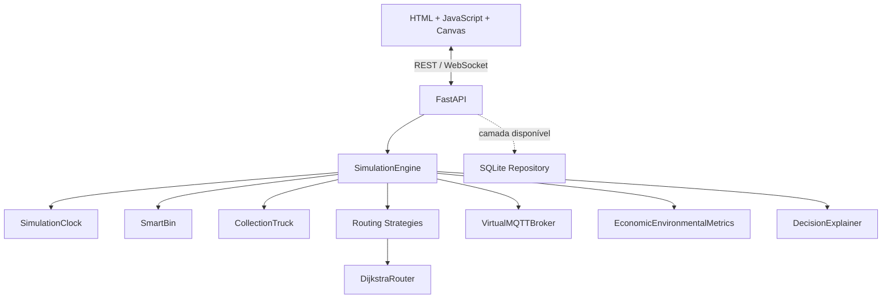
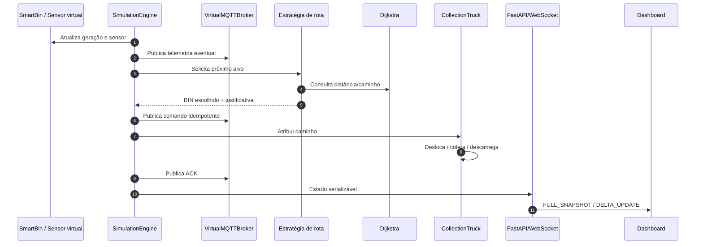

# SmartWaste DF — Arquitetura Atual

## 1. Visão geral

O SmartWaste DF é um laboratório de Digital Twin para coleta inteligente de resíduos. A implementação atual combina um backend Python/FastAPI e uma interface web em HTML/JavaScript/Canvas.

O projeto foi desenhado como **monólito modular**: um serviço FastAPI único orquestra módulos separados de domínio, roteamento, IoT, métricas e simulação.

## 2. Componentes realmente ativos



### Backend

- `FastAPI`: REST, WebSocket e entrega da interface integrada.
- `SimulationEngine`: ciclo central de simulação.
- `SimulationClock`: relógio acelerável.
- `DeterministicPRNG`: aleatoriedade reproduzível por seed.
- `SmartBin`: estado das lixeiras.
- `CollectionTruck`: movimento, coleta, carga e descarte.
- `DijkstraRouter`: menor caminho na malha simplificada.
- `FixedBaselineStrategy`, `NearestPriorityStrategy`, `SmartVRPStrategy`: seleção do próximo alvo.
- `VirtualMQTTBroker`: publish/subscribe e idempotência em memória.
- `DecisionExplainer`: justificativas de despacho.
- `EconomicEnvironmentalMetrics`: KPIs sintéticos.

### Frontend

- `index.html`: estrutura e maior parte da simulação visual.
- JavaScript: estado, eventos, Canvas, gráficos, PDF e interação.
- `apps/web/routing-docs-enhancements.js`: alinhamento das regras de roteamento da UI com o backend e extensão da documentação do PDF.

## 3. Fluxo ponta a ponta



## 4. MQTT: implementação atual

O broker atual é **virtual e em memória**. Ele não depende de Eclipse Mosquitto.

Funcionalidades simuladas:

- tópicos;
- publish/subscribe;
- histórico;
- retain;
- QoS registrado;
- idempotência de comandos por `command_id`.

Uma evolução futura pode substituir essa classe por Mosquitto/EMQX mantendo contratos semelhantes.

## 5. Persistência

Existe uma camada de repositório SQLite, porém o fluxo principal do `SimulationEngine` ainda opera em memória.

Portanto:

- não afirmar que toda telemetria é persistida hoje;
- não afirmar que a simulação sobrevive a reinício;
- considerar SQLite uma camada disponível para próxima integração.

## 6. Roteamento

A arquitetura separa:

- **seleção do alvo**: estratégias;
- **seleção do caminho**: Dijkstra.

Isso permite comparar políticas sem reescrever o algoritmo de grafo.

## 7. Modo de execução

### Laboratório integrado

```text
python run_lab.py
        ↓
uvicorn / FastAPI :8000
        ↓
index.html + módulo de enhancements
        ↓
REST + WebSocket
```

### Simulador visual

A interface mantém lógica local para fins de demonstração. Algumas capacidades visuais, como frota de 1–10 caminhões, ainda não estão parametrizadas no backend.

## 8. Limitações arquiteturais

- frontend grande e concentrado em `index.html`;
- lógica duplicada entre navegador e backend;
- broker não é MQTT de rede;
- DB não está ligado ao fluxo principal;
- malha geográfica simplificada;
- baseline analítico por multiplicadores;
- dependências web carregadas por CDN;
- ausência de autenticação e RBAC.

## 9. Evolução sugerida

- modularização/TypeScript no frontend;
- backend como fonte única de verdade;
- SQLite/Postgres conectado ao motor;
- Mosquitto/EMQX real;
- OR-Tools para CVRP/VRPTW;
- testes E2E;
- dados geográficos e de trânsito reais;
- observabilidade e autenticação.
