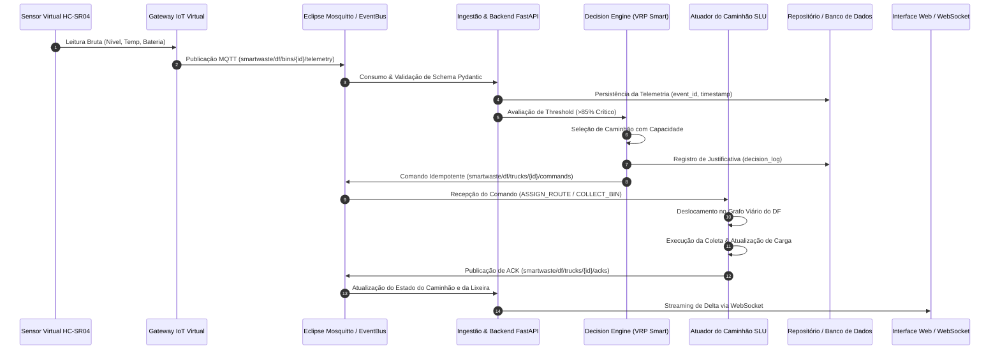

# SmartWaste DF — Arquitetura de Software & Digital Twin IoT

## 1. Visão Geral do Sistema

O **SmartWaste DF** é um Digital Twin e plataforma de simulação de coleta inteligente de resíduos para o Distrito Federal. O sistema opera sob dois modos arquiteturais complementares:

1. **Modo Laboratório Completo (API + Broker + WebSocket)**:
   * Backend Python FastAPI estruturado como Monólito Modular.
   * Emissor/consumidor de telemetria IoT via tópicos MQTT padronizados (`smartwaste/df/...`).
   * Motor de regras de criticidade com detector de transbordo.
   * Algoritmo de roteamento VRP Smart Dinâmico, comparável com Baseline Rota Fixa e Heurística de Proximidade.
   * Rastreabilidade total com identificadores únicos: `event_id`, `correlation_id` e `command_id` idempotente.
   * Streaming de eventos e deltas via WebSocket para os clientes conectados.

2. **Modo Demo PWA (Offline-First / Zero Custo)**:
   * Execução 100% autônoma no navegador web.
   * Motor de simulação desacoplado com relógio determinístico via Seed.
   * Renderizador 2D de alta performance em Canvas a 60 FPS.
   * Sem dependências de contas pagas, chaves de API externas ou SaaS.

---

## 2. Fluxo Canônico de Informação (Ponta a Ponta)

---

## 3. Topologia Geográfica de Brasília

A malha urbana modela os eixos fundamentais do Distrito Federal:
* **Plano Piloto**: Eixo Monumental (Torre de TV, Rodoviária, Esplanada, Congresso), Eixo Rodoviário Norte e Sul (Eixões), W3 e L2.
* **Cidades Satélites**: Taguatinga (Centro, Norte, Sul), Ceilândia (P-Norte, Centro, Guariroba), Samambaia Norte/Sul, Águas Claras, Guará I e II, Sudoeste.
* **Rodovias de Integração**: EPTG (DF-085), Via Estrutural (DF-095), EPNB (DF-075) e DF-001 (Pistão).
* **Ponto de Descarte Central**: Aterro Sanitário de Brasília (Samambaia / DF-459).
* **Garagem Operacional**: Garagem Central do SLU no Setor de Indústria e Abastecimento (SIA).
